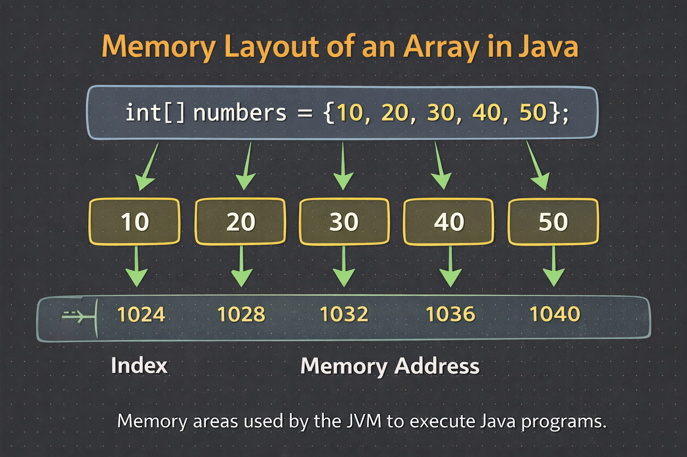

# Importance of Arrays in Java

Arrays are one of the most fundamental data structures in Java. They allow us to store, access, and manipulate multiple values of the same data type efficiently using a single variable name.

# Why Arrays Are Important
1. Store Multiple Values Efficiently

Arrays allow storing many values under one variable instead of creating multiple variables.

Example: int[] marks = {85, 90, 78, 92};

2. Fast Access Using Index

Array elements are stored in contiguous memory

Accessing any element takes constant time O(1)
Example: int first = marks[0];

